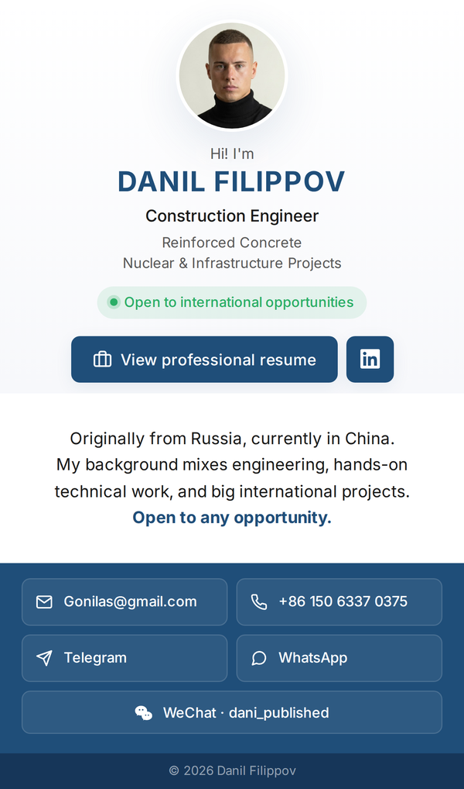

<div align="center">

# DANIL FILIPPOV

### Construction Engineer

Construction engineer with a background in large-scale infrastructure and nuclear power projects.

[](#)

<br>

<a href="https://gonilas.github.io/CV/">
  
</a>

<br><br>

<a href="https://gonilas.github.io/CV/">
  
</a>

<br>

[](./Filippov_Danil_Resume.pdf)
[](https://www.linkedin.com/in/filippovds/)
[](mailto:Gonilas@gmail.com)

---

</div>

## 🏗️ Core Expertise

**Recent focus:** Reinforced concrete on a $30B Rosatom nuclear power plant in Egypt — 150+ team, 25,000+ m³ of concrete placed, regulatory inspections coordinated with Worley (Owner's Engineer) and ENRRA (Egyptian Nuclear Regulator).

**Broader background:** Bridge & tunnel construction · Heritage restoration · Engineering surveying · Certified manual arc welder · Certified electrical fitter.

**Interests:** Sustainable construction, energy-efficient methods, lean methodologies (Rosatom Production System).

---

## 📁 About This Repository

A self-hosted digital business card, built with vanilla HTML/CSS and deployed on GitHub Pages. Designed mobile-first to fit a single device screen without scrolling, and linked to a printed business card via QR code.

**Stack:** HTML · CSS · GitHub Pages · Inter typeface (via jsDelivr CDN)

```
.
├── index.html                    # Single-page digital business card
├── profile.jpg                   # Profile photo (used as favicon and avatar)
├── wechat-qr.jpg                 # WeChat QR for in-modal display
├── Filippov_Danil_Resume.pdf     # Downloadable resume
├── preview.png                   # README preview screenshot
└── .github/workflows/            # Auto-updates README date on commit
```

**Live:** [gonilas.github.io/CV](https://gonilas.github.io/CV/)

---

<div align="center">

<sub>Last updated: <!-- LAST-UPDATED -->May 2026<!-- /LAST-UPDATED --></sub>

</div>
